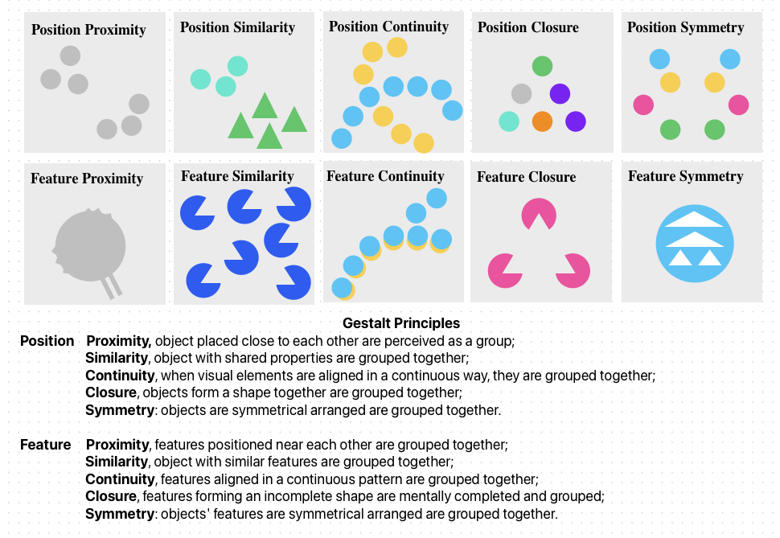

# Category Example: [Click Here](scripts/README.md)

# Gestalt Pattern Reasoning Benchmark

## Overview
This repository contains a dataset and benchmarking framework for **Gestalt pattern reasoning**. The dataset consists of thousands of procedurally generated visual patterns based on **Gestalt principles**, including proximity, similarity, closure, symmetry, and continuity. The benchmark is designed to evaluate both human and AI performance in recognizing and reasoning about these patterns.

## Dataset Loading
The dataset has already been generated and uploaded to the [Huggingface](https://huggingface.co/datasets/akweury/ELVIS).
This repository on the Github also includes all the code for generating the dataset.
## Installation
To use this benchmark, first clone the repository and install dependencies:
```bash
git clone https://github.com/akweury/gestalt_benchmark.git
cd gestalt_benchmark
pip install -r requirements.txt
```

## Pattern Generation
To generate all patterns across all principles, run:
```bash
python scripts/main.py
```

Generated patterns will be saved in `data/raw_patterns/`.

## Benchmarking AI Models
To evaluate AI models on the dataset:
```bash
python scripts/evaluate_models.py 
```
Results will be saved in `data/results/`.

## Gestalt Principles and Patterns
The benchmark includes five **Gestalt principles**:
- **Proximity**
- **Similarity**
- **Closure**
- **Symmetry**
- **Continuity**

For each principle, there more than **100 tasks**. Each task includes:
- **x positive images** and **x negative images** for training.
- **x positive images** and **x negative images** for testing.
- (set `x` value in `config.py`)

Patterns are generated using basic objects such as:
- **Triangle**
- **Circle**
- **Square**

Each pattern has its own folder within the respective principle directory, containing **train** and **test** subdirectories, and each pattern is named in the format `id_pattern_name`.


## Using Docker

To ensure compatibility across environments, you can use Docker to build and run the project.

### Building the Docker Image
``` 
docker build -t gestalt_benchmark .
```

### Running the Container

For CPU-only:
```
docker run --rm gestalt_benchmark -it
```

For GPU-accelerated training (if available):
```
 
docker run --gpus all -it -v /home/ml-jsha/storage/grb:/app/data --rm gestalt_benchmark 

python -m scripts.main
python -m scripts.evaluate_models --batch_size 100 --principle proximity --img_num 3 --model vit --device_id 0
python -m scripts.evaluate_models --batch_size 100 --principle similarity --img_num 100 --device_id 1
python -m scripts.evaluate_models --batch_size 100 --principle closure --img_num 100 --device_id 0
python -m scripts.evaluate_models --batch_size 100 --principle symmetry --img_num 100 --device_id 5
python -m scripts.evaluate_models --batch_size 100 --principle continuity --img_num 100 --device_id 5

# train Llava
python -m scripts.evaluate_models --batch_size 1 --principle proximity --img_num 3 --model llava --device_id 0
python -m scripts.evaluate_models --batch_size 1 --principle similarity --img_num 3 --model llava --device_id 2
python -m scripts.evaluate_models --batch_size 1 --principle closure  --img_num 3 --model llava --device_id 3
python -m scripts.evaluate_models --batch_size 1 --principle symmetry --img_num 3 --model llava  --device_id 4
python -m scripts.evaluate_models --batch_size 100 --principle continuity --img_num 3 --model llava --device_id 7

python -m scripts.evaluate_models --batch_size 1 --principle symmetry --device_id 3 > /app/data/output.log

```


## File Structure
```
gestalt_benchmark/
│── data/
│   │── raw_patterns/         # Unprocessed/generated raw patterns
│   │   │── proximity/
│   │   │   │── train/
│   │   │   │   │── 0001_red_triangle/
│   │   │   │   │   │── positive/
│   │   │   │   │   │   │── 00000.png
│   │   │   │   │   │   │── 00000.json
│   │   │   │   │   │   │── 00001.png
│   │   │   │   │   │   │── 00001.json
│   │   │   │   │   │   │── 00002.png
│   │   │   │   │   │   │── 00002.json
│   │   │   │   │   │── negative/
│   │   │   │   │   │   │── 00000.png
│   │   │   │   │   │   │── 00000.json
│   │   │   │   │   │   │── 00001.png
│   │   │   │   │   │   │── 00001.json
│   │   │   │   │   │   │── 00002.png
│   │   │   │   │   │   │── 00002.json
│   │   │   │── test/
│   │   │   │   │── 0001_red_triangle/
│   │   │   │   │   │── positive/
│   │   │   │   │   │   │── 00000.png
│   │   │   │   │   │   │── 00000.json
│   │   │   │   │   │   │── 00001.png
│   │   │   │   │   │   │── 00001.json
│   │   │   │   │   │   │── 00002.png
│   │   │   │   │   │   │── 00002.json
│   │   │   │   │   │── negative/
│   │   │   │   │   │   │── 00000.png
│   │   │   │   │   │   │── 00000.json
│   │   │   │   │   │   │── 00001.png
│   │   │   │   │   │   │── 00001.json
│   │   │   │   │   │   │── 00002.png
│   │   │   │   │   │   │── 00002.json
│   │   │── similarity/
│   │   │   │── train/
│   │   │   │── test/
│   │   │── closure/
│   │   │   │── train/
│   │   │   │── test/
│   │   │── symmetry/
│   │   │   │── train/
│   │   │   │── test/
│   │   │── continuity/
│   │   │   │── train/
│   │   │   │── test/
│── scripts/
│   │── proximity/             # Folder containing scripts for proximity patterns
│   │   │── prox_patterns.py
│   │   │── util...
│   │── similarity/
│   │── closure/
│   │── symmetry/
│   │── continuity/
│   │── utils/                 # Folder containing utility functions
│   │── main.py                # Entry point to generate all patterns of all principles
│   │── config.py              # Configuration settings for colors, shapes, and numbers
│   │── evaluate_models.py     # Benchmarking models
│── README.md
│── requirements.txt
```

## Contribution
We welcome contributions to improve the dataset and evaluation framework. Please submit pull requests with explanations of changes.

## License
This project is licensed under the MIT License.

---
🚀 **Ready to challenge AI with Gestalt patterns? Start now!**
