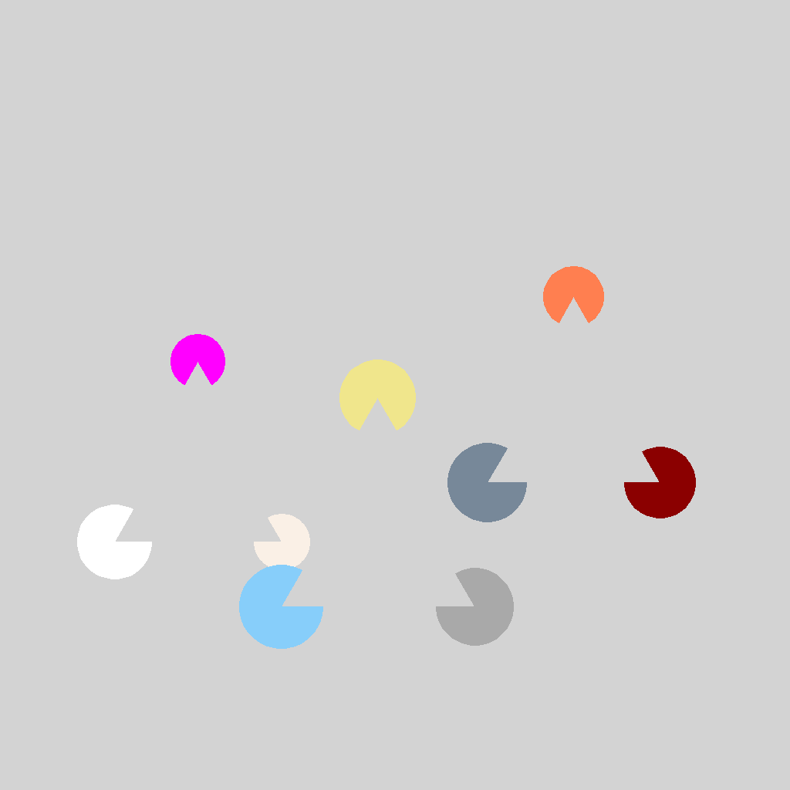
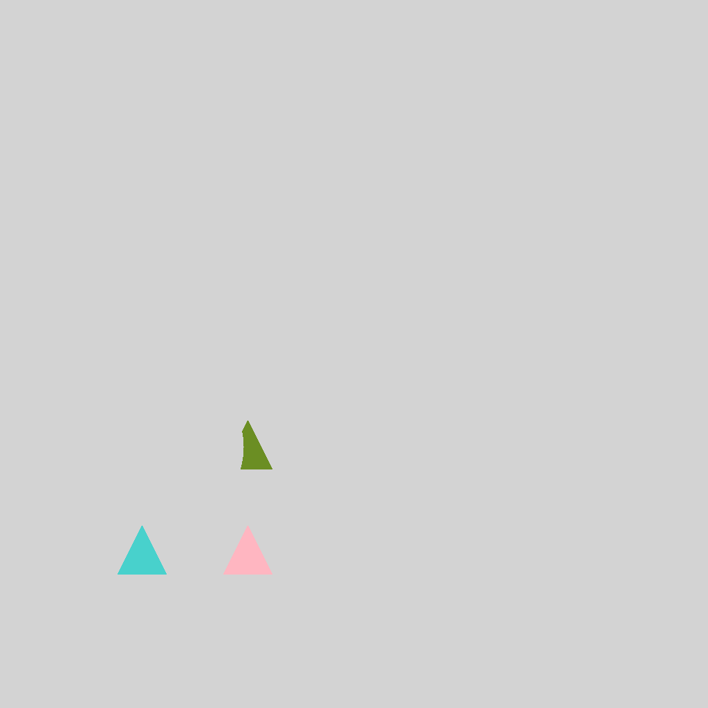

### (Back to [Category](../../README.md))

# Closure: Big Triangle
The tasks in this category follows the principle _Closure_. The base pattern shows 1-2 clusters, 
the objects of each cluster follow specific logic rules.
## Example
In positive examples, there are two groups of Closure clusters. The objects in each cluster form a shape of triangle.
The `shape` of objects in each cluster are either all square, or all circle.

  Positive:
  
  
  

  Negative:
  
  
  

# Closure: Big Square
The tasks in this category follows the principle _Closure_. The base pattern shows 1-2 clusters, 
the objects of each cluster follow specific logic rules.
## Example
In positive examples, there are two groups of Closure clusters. 
The objects in each cluster form a shape of square.
The `shape` of objects in each cluster are either all triangle, or all circle.

  Positive:
  
  
  

  Negative:
  
  
  

# Closure: Big Circle
The tasks in this category follows the principle _Closure_. The base pattern shows 1-2 clusters, 
the objects of each cluster follow specific logic rules.
## Example
In positive examples, there are one groups of Closure clusters. 
The objects in the cluster form a shape of circle.
The shape of objects in the cluster are either triangle or square, but no circles.
The `color` of the objects can be either yellow or blue.

  Positive:
  
  
  

  Negative:
  
  
  

# Closure: Feature Triangle
The tasks in this category follows the principle _Closure_. The base pattern shows 1-4 clusters, 
the objects of each cluster follow specific logic rules.
## Example
In positive examples, there are three groups of Closure clusters. 
The objects in each cluster form a shape of triangle.
The `size` of objects in each cluster are same.

  Positive:
  
  
  

  Negative:
  
  
  

# Closure: Feature Square
The tasks in this category follows the principle _Closure_. The base pattern shows 1-4 clusters, 
the objects of each cluster follow specific logic rules.
## Example
In positive examples, there are three groups of Closure clusters. 
The objects in each cluster form a shape of square.
The `size` of objects in each cluster are same.

  Positive:
  
  
  

  Negative:
  
  
  

# Closure: Feature Circle
The tasks in this category follows the principle _Closure_. The base pattern shows 1-4 clusters, 
the objects of each cluster follow specific logic rules.
## Example
In positive examples, there are one groups of Closure clusters. 
The objects in each cluster form a shape of circle.
The `size` of objects in each cluster are same.

  Positive:
  
  
  

  Negative:
  
  
  

### (Back to [Category](../../README.md))