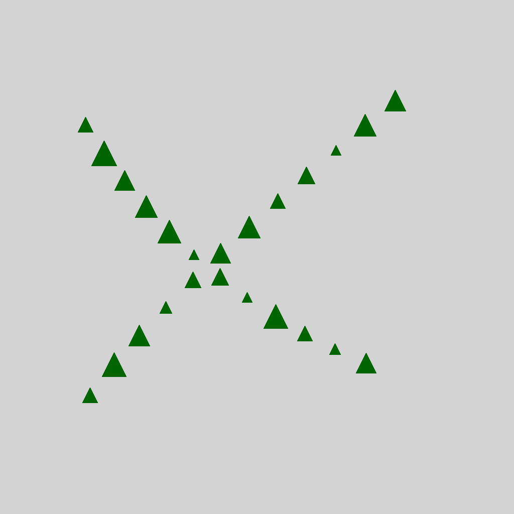

### (Back to [Category](../../README.md))

# Continuity: One Split N
The tasks in this category follows the principle _Continuity_. The base pattern shows 2 clusters, 
the objects of each cluster follow specific logic rules.
## Example
In positive examples, the objects are placed following a line, the line splits at some point to two paths. 
The object shapes of one path are same. 

  Positive:
  
  
  

  Negative:
  
  
  

# Continuity: Two Splines
The tasks in this category follows the principle _Continuity_. The base pattern shows 2 clusters, 
the objects of each cluster follow specific logic rules.
## Example
In positive examples, there are two Continuity groups. The objects of each group form a spline shape.
The object sizes of each group are same. 

  Positive:
  
  
  

  Negative:
  
  
  

# Continuity: A Splines
The tasks in this category follows the principle _Continuity_. The base pattern shows 2 clusters, 
the objects of each cluster follow specific logic rules.
## Example
In positive examples, there are Two Continuity groups. The two groups form a shape of letter "A".
The objects in each group has same size.

  Positive:
  
  
  

  Negative:
  
  
  

# Continuity: U Splines
The tasks in this category follows the principle _Continuity_. The base pattern shows 2 clusters, 
the objects of each cluster follow specific logic rules.
## Example
In positive examples, there are Two Continuity groups. The two groups form a shape of inverse letter A.
The objects in each group has same color.

  Positive:
  
  
  

  Negative:
  
  
  

# Continuity: X Splines
The tasks in this category follows the principle _Continuity_. The base pattern shows 2 clusters, 
the objects of each cluster follow specific logic rules.
## Example
In positive examples, there are Two Continuity groups. The two groups form a shape of inverse letter X.
One of the continue group are consists with two duplicate splines with same features but shifts a small positions.
The objects in each group has same color.

  Positive:
  
  
  

  Negative:
  
  
  

### (Back to [Category](../../README.md))